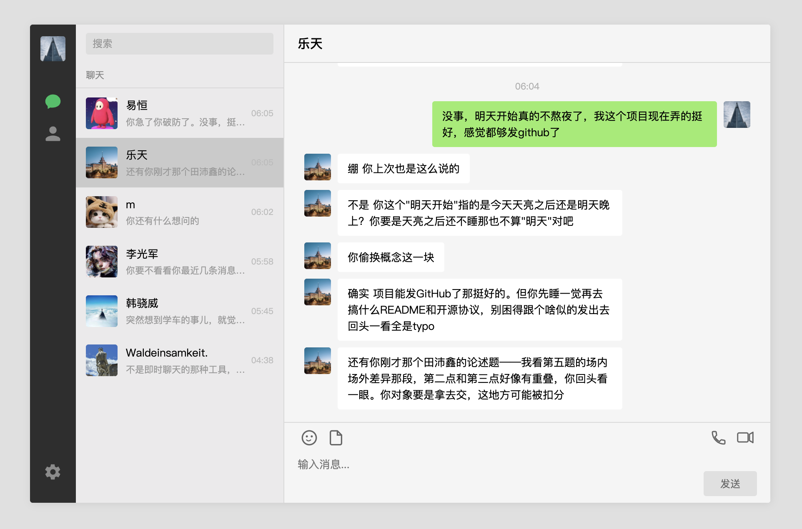

<p align="center">
  
  
  
</p>
# WeChat Skill Chat

**和你的 AI 人格在微信里聊天。**

一个像素级复刻微信 PC 版界面的聊天应用。导入一个 skill 文件夹，它就成了你的微信好友——像真人一样说话，用微信的黄脸表情，能读你发的文件。把任何 LLM persona 变成联系人。


<p align="center">
  
</p>

---

## 兼容性

本项目使用 **Anthropic Messages API**（`/v1/messages`）。任何兼容该协议的 API 提供商均可使用，包括：

| 提供商 | Base URL |
|--------|----------|
| **Anthropic** | 留空（SDK 自动使用 `https://api.anthropic.com`） |
| **DeepSeek** | `https://api.deepseek.com/anthropic` |
| 其他兼容网关 | 填入对应的 `/anthropic` 或 `/v1/messages` 端点 |

只要你的 API 能响应 `POST /v1/messages` 并返回 Anthropic 格式的 `content` 数组，就能用。不兼容 OpenAI Chat Completions 格式（`/v1/chat/completions`）。

---

## 功能

- **微信 PC 版 1:1 界面** — 55px 导航栏、250px 联系人列表、自适应聊天区，配色布局完全对齐
- **Skill 即联系人** — 每个人格是独立的联系人，独立的头像、聊天记录、对话风格
- **导入即用** — 选择一个 skill 文件夹，自动验证、注册、生成头像、复制 persona
- **文件附件** — 一次选多个文件发给 AI，支持 txt/docx/pdf，自动提取文本注入上下文
- **聊天记录持久化** — 每个联系人一个 JSON，关掉浏览器再打开还在，按最新消息自动排序
- **多模型切换** — 设置里填 API Key + Base URL + Model，随时切 Anthropic ↔ DeepSeek
- **零硬编码** — 联系人是 `skills_config.json` 数据文件，增删改在 UI 完成，不动代码
- **可移植** — `pip install flask anthropic && python3 server.py`，整个文件夹下载下来就能跑

---

## Skill 格式

本项目导入的 skill 需要是一个**文件夹**，最低要求包含以下文件之一（优先级：`SKILL.md` > `persona.md`，两者同时存在时只读 `SKILL.md`）：

### 方式 A：单文件 `SKILL.md`（推荐）

```
my-skill/
├── SKILL.md        # 完整的 persona + work 合并文件
└── meta.json       # 可选，提供 display_name、标签等元数据
```

这是 dot-skill 的标准输出格式。`SKILL.md` 即为完整的 system prompt，约 20-30KB，包含角色描述、说话风格、行为规则等。

### 方式 B：分离文件 `persona.md` + `work.md`

```
my-skill/
├── persona.md      # 人物性格（必选）
├── work.md         # 工作能力（可选）
└── meta.json       # 可选
```

导入时自动合并 `persona.md` 和 `work.md`。

### meta.json（可选）

```json
{
  "display_name": "肖易恒",
  "name": "colleague-xiaoyiheng",
  "tags": ["NPD", "自恋型人格障碍", "北京林业大学"]
}
```

- `display_name` → 联系人列表显示的名字（优先于文件夹名）
- `name` → 内部 skill 名
- 没有 `meta.json` 时使用文件夹名

> **制作 skill**：用 `/dot-skill` 从聊天记录蒸馏高还原度人格，或用任何 LLM 写一段角色描述存为 `SKILL.md`。

---

## 快速开始

### 1. 安装

```bash
git clone https://github.com/AndreiB180/wechat-skill-chat.git
cd wechat-skill-chat
pip install flask anthropic
```

### 2. 启动

```bash
python3 server.py
```

打开 `http://localhost:5888`。

### 3. 配置 API

左下角齿轮 → 设置：

| 字段 | Anthropic | DeepSeek |
|------|-----------|----------|
| Base URL | 留空（SDK 默认） | `https://api.deepseek.com/anthropic` |
| Model | `claude-sonnet-4-20250514` | `deepseek-v4-pro` |
| API Key | `sk-ant-...` | `sk-...` |

API Key 保存时自动 base64 混淆，不会明文泄露。

### 4. 导入 Skill

通讯录 → **+ 添加 Skill** → 输入文件夹路径 → 导入。新的联系人即刻出现在聊天列表。

---

## 架构

```
wechat-skill-chat/
├── server.py                    # Flask 入口，注册 4 个 Blueprint
├── skills_config.json           # 联系人注册表（JSON 数据，非代码）
├── settings.json                # API 配置（gitignore）
├── backend/
│   ├── config.py                # JSON 读写 + fcntl 文件锁
│   ├── skills.py                # Persona 三级查找加载
│   ├── ai.py                    # Anthropic SDK 封装 + WeChat 格式注入
│   ├── history.py               # 聊天记录 CRUD（fcntl 锁，200 条/人上限）
│   └── routes/
│       ├── chat_routes.py       # /api/send, /api/history
│       ├── contacts_routes.py   # /api/config, import/delete/update
│       ├── settings_routes.py   # /api/settings
│       └── static_routes.py     # /avatars, /emoji
├── templates/index.html         # 微信 PC 版 1:1 结构
├── static/
│   ├── css/style.css            # 完整样式
│   ├── js/chat.js               # 前端逻辑（Session隔离/乐观UI/Emoji渲染）
│   ├── emoji/{face,gesture,...}  # 109 个微信黄脸 PNG
│   └── avatars/                 # SVG 头像
└── skills/                      # 用户导入的 skill 文件
```

**数据流**：用户发消息 → Flask → 加载 SKILL.md → 拼入 system prompt（最高优先级格式指令）→ Anthropic Messages API → 按换行拆成多条 → 渲染聊天气泡。

---

## 细节

### 消息发送

用户消息先渲染绿气泡（乐观 UI），不等 API 返回。API 响应后追加白气泡。切换会话时 `chatId` 捕获机制保证消息不串到别人那里。中文输入法组合输入期间 Enter 不触发发送。

### 并发安全

`skills_config.json` 和 `chat_history/*.json` 使用 `fcntl.flock` 文件锁，多个请求同时操作不会损坏数据。每人的聊天记录上限 200 条。

### 表情渲染

109 个微信原生黄脸 PNG 按 `face/gesture/animal/blessing/other` 五类分目录。前端 `_emojiLookup` 映射中文名到目录，`[捂脸]` 在聊天气泡中渲染为 ``。表情选择面板可直接点击插入。

### 时间格式化

| 距离 | 聊天气泡 | 联系人卡片 |
|------|---------|-----------|
| 今天 | `14:30` | `14:30` |
| 昨天 | `昨天 14:30` | `昨天14:30` |
| 2-6天前 | `星期三 14:30` | `星期三` |
| 今年内 | `5/20 14:30` | `5/20` |
| 更早 | `2025/12/3 14:30` | `2025/12/3` |

### AI 格式约束

每次 API 调用前，system prompt 最前面注入最高优先级格式指令，强制模型：
- **禁止 Markdown 语法** — `# * ** ~~ \` \`\`\`` 等全部禁用，微信没人用这些
- 禁止 `（顿了顿）` 等括号动作描写
- 禁止旁白、叙述性文字、场景描述
- 表情用 `[捂脸]` 格式
- 消息简短、口语化、无剧本感

### 输入框

工具栏含表情/文件/语音通话/视频通话四个图标。语音/视频通话点击弹出 `"你走火入魔了，还真想给 AI 打电话啊？"`。输入框可拖拽顶部边框调整高度（52-120px）。有文字时发送按钮变微信绿。

### 文件附件

前端将文件转为 base64 传给后端。后端根据扩展名选择解析器：

| 类型 | 支持 | 需要 |
|------|------|------|
| `.txt` `.md` `.py` 等 | ✓ 内置 | 无 |
| `.docx` | ✓ | `pip install python-docx` |
| `.pdf`（有文本层） | ✓ | `pip install PyPDF2` |

提取文本截断到 100,000 字符注入 API 调用。聊天记录存 JSON 时再截断预览，避免历史文件过大。
